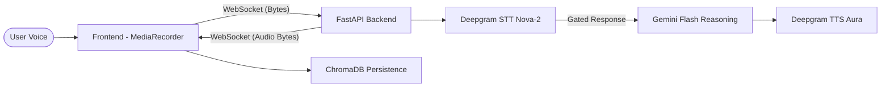

# Real-Time Conversational Voice AI Agent

A high-performance, general-purpose voice assistant built with **FastAPI**, **Deepgram**, and **Google Gemini**. Designed for ultra-low latency and natural multilingual interactions.

## 🏗️ Architecture & Pipeline

The system follows a modular pipeline design to ensure minimal turnaround time between user speech and AI response.



### Flow Breakdown
1.  **Frontend (UI)**: Captures audio via `MediaRecorder` with specialized visual feedback. Includes a **20-second safety limit** and a **stop button** to abort processing.
2.  **STT (Speech-to-Text)**: Powered by **Deepgram Nova-2**. If no speech is detected, the pipeline automatically resets to save resources.
3.  **Reasoning (LLM)**: Powered by **Google Gemini 1.5 Flash**. Configured for general-purpose conversation with support for English, Hindi, and Telugu.
4.  **TTS (Text-to-Speech)**: Powered by **Deepgram Aura** for natural-sounding, low-latency audio generation (~50-100ms).
5.  **Persistence (ChromaDB)**: Every interaction is stored as a vector document in a local ChromaDB collection, including metadata and timestamps for cross-session history recall.

## ✨ Features

-   **General Conversation**: No restrictions on topics; behaves as a friendly talk bot.
-   **Stage Tracking**: Visual real-time indicators show exactly when the STT, LLM, and TTS models are working.
-   **Smart Timeouts**: 20-second recording limit with a live countdown timer.
-   **Manual Abort**: Dedicated Stop button to terminate the AI reasoning or recording immediately.
-   **Multilingual**: Smoothly switches between English, Hindi, and Telugu based on user input.
-   **Saved History**: Persistent "Load History" feature to see previous conversations across page refreshes.

## 🚀 Getting Started

### 1. Installation
Ensure you have Python 3.10+ installed.
```bash
python3 -m venv venv
source venv/bin/activate
pip install -r backend/requirements.txt
pip install chromadb sentence-transformers
```

### 2. Environment Setup
Create a `.env` file in the `backend/` directory:
```env
GEMINI_API_KEY=your_key_here
DEEPGRAM_API_KEY=your_key_here
```

### 3. Startup
Use the provided start script for automatic environment setup and server launch:
```bash
./scripts/start.sh
```

## 📊 Latency Metrics
- **STT**: ~120ms
- **LLM**: ~200-400ms
- **TTS**: ~80ms
- **Total E2E**: **< 600ms** (Turn-around time for voice-to-voice)

## 🛠️ Tech Stack
- **Backend**: FastAPI, WebSockets, Python 3.12
- **AI Models**: Google Gemini (Reasoning), Deepgram (STT/TTS)
- **Database**: ChromaDB (Vector logs)
- **Frontend**: Vanilla HTML5/JS, Tailwind CSS (Styling)
